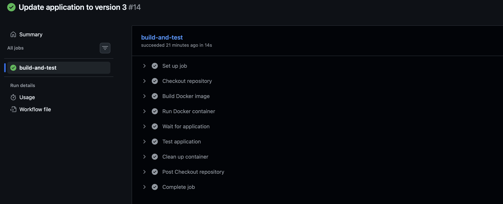
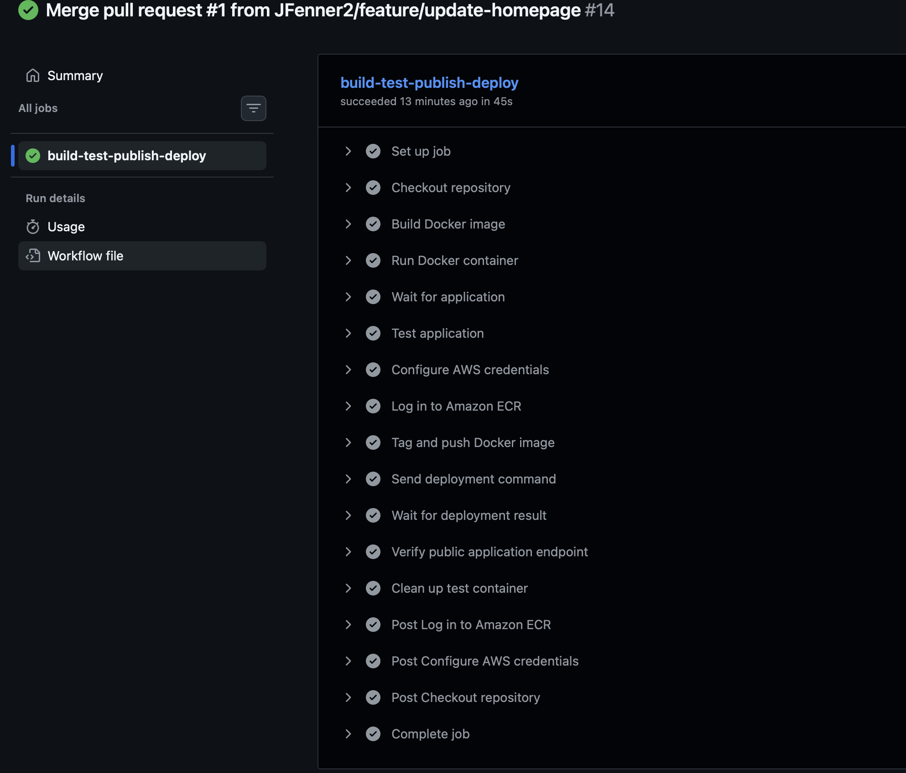
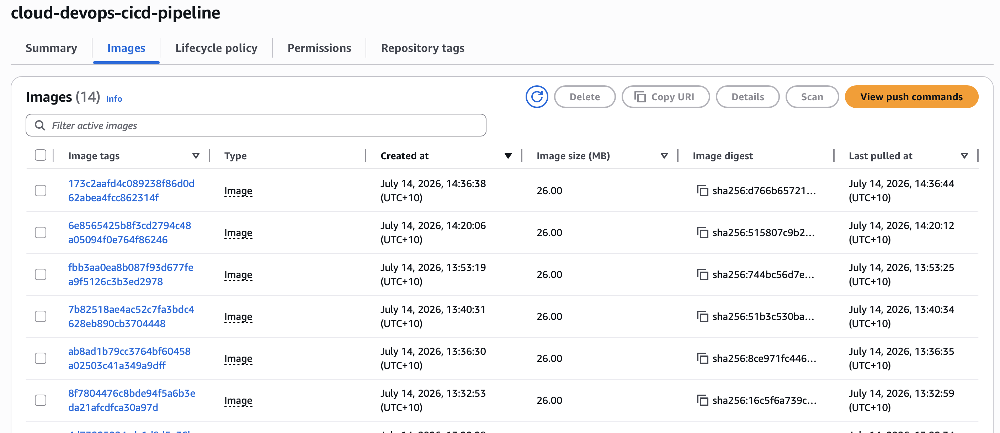
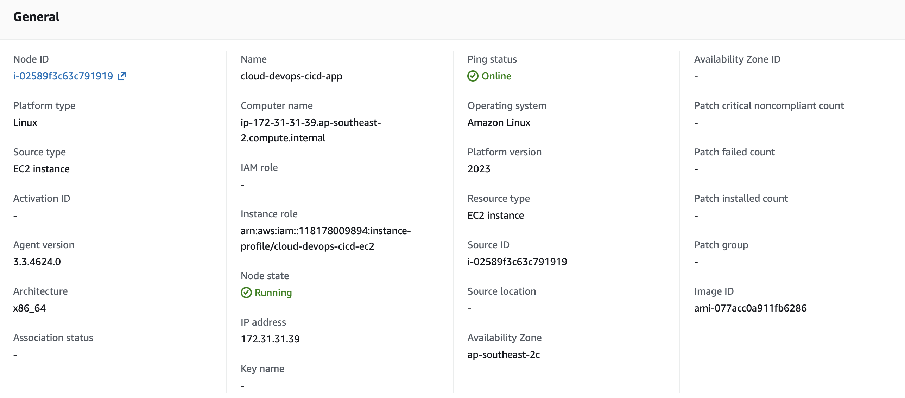
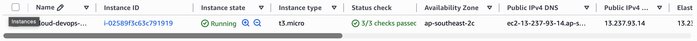
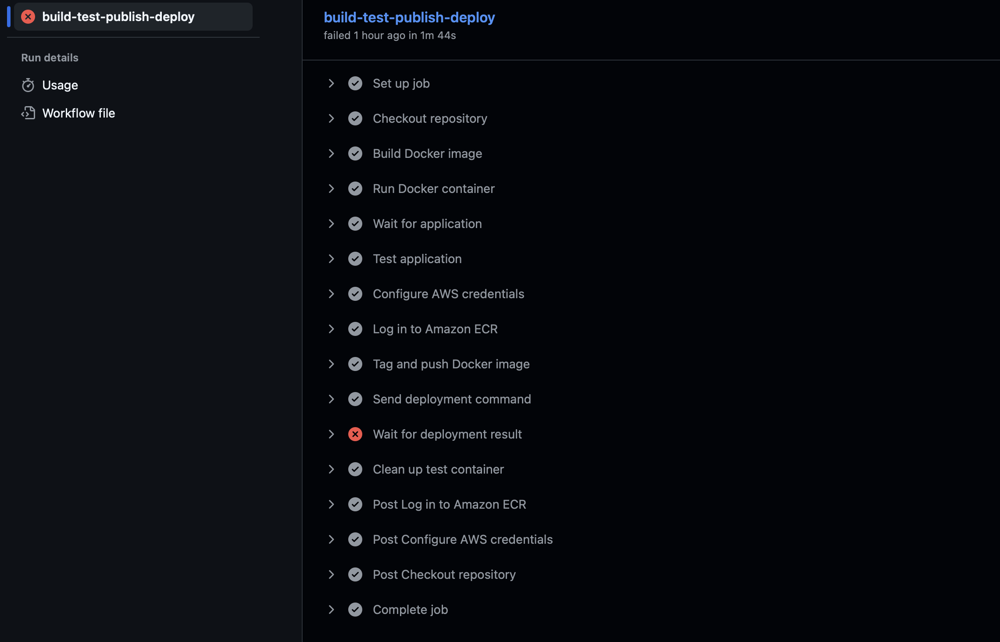
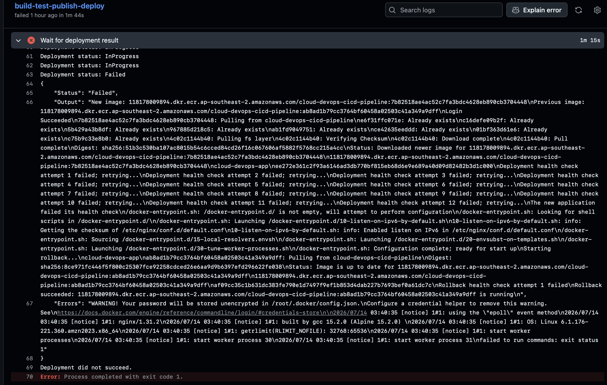
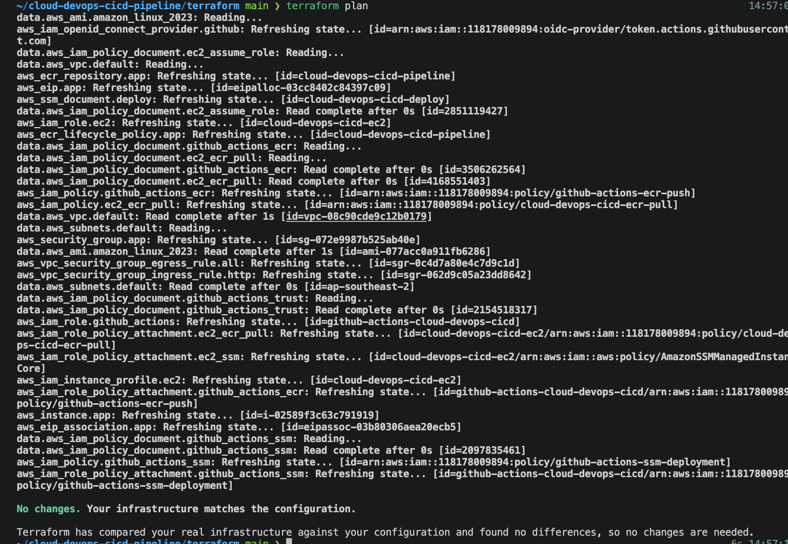
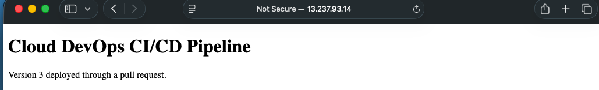

# Secure AWS CI/CD Pipeline

A secure end-to-end CI/CD pipeline that automatically builds, tests, publishes and deploys a containerised web application to AWS.

The project uses GitHub Actions, Docker, Terraform, Amazon ECR, EC2 and AWS Systems Manager. GitHub authenticates to AWS through OpenID Connect (OIDC), avoiding long-lived AWS access keys and SSH-based deployment.

## Project Overview

This project demonstrates how an application change can move from a Git feature branch into a running AWS environment through an automated and controlled delivery process.

The pipeline performs the following process:

```text
Feature branch
    ↓
Pull request
    ↓
Continuous Integration
    ↓
Docker build and application tests
    ↓
Merge into protected main branch
    ↓
GitHub Actions assumes AWS role through OIDC
    ↓
Docker image tagged with Git commit SHA
    ↓
Image pushed to Amazon ECR
    ↓
AWS Systems Manager instructs EC2 to deploy
    ↓
EC2 pulls and starts the new container
    ↓
Internal and public health checks
    ↓
Successful deployment or automatic rollback
```

## Technologies Used

- Git and GitHub
- GitHub Actions
- YAML
- Docker
- Nginx
- Terraform
- AWS IAM
- AWS OpenID Connect
- Amazon ECR
- Amazon EC2
- AWS Systems Manager
- Amazon VPC
- Elastic IP
- Bash
- Linux

## Repository Structure

```text
.
├── .github
│   └── workflows
│       ├── ci.yml
│       └── deploy.yml
├── app
│   ├── Dockerfile
│   └── index.html
├── screenshots
│   ├── cd-screenshot.png
│   ├── ci-screenshot.png
│   ├── ecr-screenshot.png
│   ├── live-application-ip.png
│   ├── rollback-test-1.png
│   ├── rollback-test2.png
│   ├── running-ec2.png
│   ├── system-manager-node.png
│   └── terraform-plan.png
├── terraform
│   ├── ec2-iam.tf
│   ├── ec2.tf
│   ├── ecr.tf
│   ├── elastic-ip.tf
│   ├── github-ssm-iam.tf
│   ├── iam.tf
│   ├── network.tf
│   ├── oidc.tf
│   ├── outputs.tf
│   ├── provider.tf
│   ├── ssm.tf
│   ├── user-data.sh
│   ├── variables.tf
│   └── versions.tf
├── .gitignore
└── README.md
```

## Continuous Integration

The CI workflow runs when a pull request is opened or updated.

It:

1. Creates a temporary Ubuntu runner.
2. Checks out the repository.
3. Builds the Docker image.
4. Starts a test container.
5. Verifies that the application returns a successful HTTP response.
6. Confirms that the expected page content exists.
7. Cleans up the test container, even if an earlier step fails.

The protected `main` branch requires the `build-and-test` status check to pass before a pull request can be merged.



## Continuous Deployment

The deployment workflow runs only after a change reaches `main`.

It:

1. Builds and tests the application.
2. Requests an OIDC identity token from GitHub.
3. Assumes a restricted AWS IAM role.
4. Logs in to Amazon ECR.
5. Tags the Docker image using the full Git commit SHA.
6. Pushes the immutable image to ECR.
7. sends a deployment request through AWS Systems Manager.
8. Waits for the SSM command to complete.
9. Verifies the application through its public endpoint.
10. Reports the deployment as successful or failed.



## Secure AWS Authentication

The pipeline does not store AWS access keys in GitHub.

GitHub Actions uses OIDC federation to request temporary AWS credentials. AWS validates the token against the IAM role trust policy before allowing the workflow to assume the role.

The trust relationship is restricted by:

- GitHub repository owner
- Repository name
- `main` branch
- Expected AWS STS audience

The workflow explicitly requests only:

```yaml
permissions:
  contents: read
  id-token: write
```

The temporary credentials expire after the workflow and are not committed to the repository.

## Least-Privilege IAM

Separate IAM roles are used for GitHub Actions and EC2.

The GitHub Actions role can:

- Request an ECR authentication token.
- Push images only to the project ECR repository.
- Send the project deployment document to the application instance.
- Read the result of the deployment command.

The EC2 role can:

- Register the instance with Systems Manager.
- Authenticate to ECR.
- Pull images from the project repository.

The EC2 instance does not require AWS credentials stored in configuration files.

## Amazon ECR

Amazon ECR stores the Docker images produced by the pipeline.

Each image is tagged with the Git commit SHA, creating traceability between:

```text
Git commit → Workflow run → ECR image → EC2 deployment
```

Image tags are immutable, preventing an existing version tag from being silently replaced.

An ECR lifecycle policy retains only the ten most recent images to control storage usage.



## EC2 and Systems Manager Deployment

The application runs as an Nginx container on an Amazon Linux 2023 EC2 instance.

The instance is prepared through EC2 user data, which:

- Installs Docker.
- Starts and enables Docker.
- Starts and enables the SSM Agent.
- Adds the default EC2 user to the Docker group.

GitHub Actions does not SSH into the instance. Instead, it calls AWS Systems Manager Run Command using a custom SSM document managed by Terraform.

This avoids:

- Storing an SSH private key in GitHub.
- Exposing port 22.
- Allowing GitHub runner IP addresses through the security group.
- Creating a deployment user with permanent credentials.





## Health Checks and Automatic Rollback

The deployment process records the last successfully deployed image.

For each deployment, the SSM document:

1. Authenticates to ECR.
2. Pulls the requested immutable image.
3. Removes the existing application container.
4. Starts the new container.
5. Repeatedly checks the local HTTP endpoint.
6. Confirms that the expected page content exists.
7. Records the new image as the known-good version.

If the new container fails to start or does not pass its health check, the deployment process:

1. Removes the failed container.
2. Pulls the previous known-good image.
3. Restarts the previous version.
4. Verifies that the restored application is healthy.
5. Returns a failed status to GitHub Actions.

The workflow remains red because the requested deployment failed, even when rollback successfully protects the running application.





## Network and EC2 Security

The infrastructure includes:

- A security group allowing inbound HTTP on port 80.
- No inbound SSH rule.
- An Elastic IP providing a stable application endpoint.
- Encrypted EC2 root storage.
- IMDSv2 required for instance metadata access.
- IAM instance roles instead of locally stored AWS credentials.
- A private ECR repository with AES-256 encryption.

## Infrastructure as Code

Terraform provisions and manages:

- Amazon ECR repository and lifecycle policy
- GitHub OIDC provider
- GitHub Actions IAM role and policies
- EC2 IAM role and instance profile
- Amazon Linux EC2 instance
- Security group
- Elastic IP
- Custom Systems Manager deployment document
- Terraform outputs used to configure the pipeline

The infrastructure was checked using:

```bash
terraform fmt -check
terraform validate
terraform plan
```



## GitHub Repository Variables

The deployment workflow reads non-secret configuration from GitHub Actions repository variables:

```text
AWS_REGION
AWS_ROLE_ARN
ECR_REPOSITORY
EC2_INSTANCE_ID
SSM_DOCUMENT_NAME
APPLICATION_URL
```

These values identify resources but do not provide authentication. AWS access is granted only after successful OIDC federation and IAM trust-policy validation.

## Deployment Evidence

The application was successfully deployed through the complete pull-request workflow and updated automatically after the change was merged into `main`.



The public URL shown in the screenshot may no longer be active after the Terraform infrastructure is destroyed.

## Failure Testing and Troubleshooting

The project included deliberate failure testing rather than validating only successful deployments.

Failures investigated included:

- Missing `ssm:SendCommand` permission.
- Incorrect YAML indentation.
- Application content not matching the CI test.
- An invalid container port mapping.
- Duplicate-looking workflow activity caused by CI and CD responding to the same push.
- Terraform commands being run from the wrong directory.
- Terraform interpreting Bash parameter expansion as Terraform interpolation.

These tests demonstrated how to:

- Read GitHub Actions logs.
- Identify the exact failed workflow step.
- Interpret AWS access-denied messages.
- Correct least-privilege IAM policies.
- Inspect SSM command output.
- Distinguish CI failures from deployment failures.
- Verify that rollback restores the previous application version.

## Key Lessons

This project developed practical understanding of:

- The difference between Continuous Integration and Continuous Deployment.
- GitHub Actions workflows, jobs, steps and runners.
- YAML configuration and indentation.
- GitHub Actions `uses`, `run` and `if` behaviour.
- Secure cloud authentication with OIDC.
- Least-privilege IAM design.
- Building once and deploying the same tested artifact.
- Immutable Docker image versioning.
- Remote deployment through Systems Manager.
- Automated health verification.
- Rollback to a known-good application version.
- Branch protection and pull-request-based delivery.
- Separating infrastructure management from application deployment.

## Reproducing the Infrastructure

Prerequisites:

- AWS account
- Terraform
- Docker
- Git
- GitHub repository
- AWS CLI configured for the initial Terraform deployment

Review the defaults in:

```text
terraform/variables.tf
```

Then initialise and review the infrastructure:

```bash
cd terraform
terraform init
terraform fmt -check
terraform validate
terraform plan
```

Create the infrastructure only after reviewing the plan:

```bash
terraform apply
```

Use the Terraform outputs to create the required GitHub repository variables.

The GitHub OIDC trust policy must match the correct repository owner, repository name and deployment branch.

## Destroying the Infrastructure

Before destruction, the ECR repository may need to be emptied because it contains immutable images.

After preserving the required evidence, destroy the AWS resources from the Terraform directory:

```bash
terraform plan -destroy
terraform destroy
```

Terraform state and plan files are intentionally excluded from Git through `.gitignore`.

## Project Outcome

This project replaced manual deployment with a secure, repeatable delivery system.

A developer can now create a feature branch, open a pull request and receive automated CI feedback. After the approved change is merged into `main`, GitHub Actions builds a versioned Docker image, publishes it to ECR, deploys it to EC2 through Systems Manager and verifies the public application.

If the new release fails, the previous known-good image is restored automatically while the pipeline reports the failed deployment for investigation.
